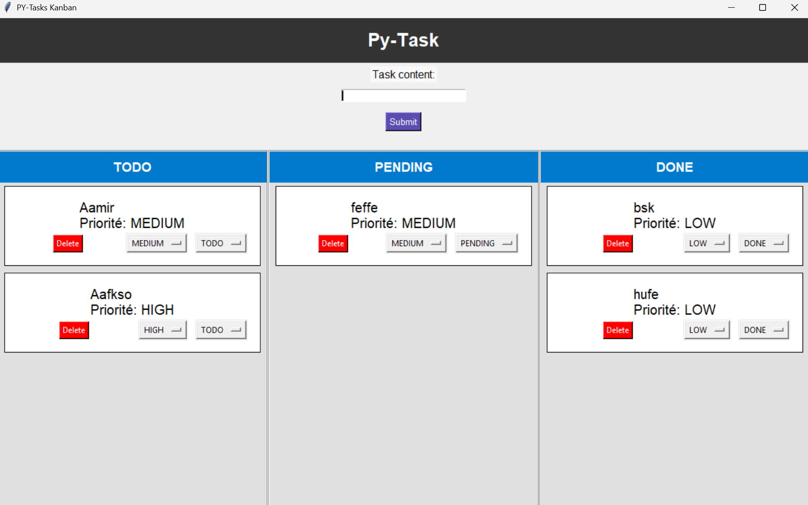

# Application de Gestion de Tâches (To-Do List)

## Description

Une application Python avec interface graphique Tkinter permettant de gérer une liste de tâches avec persistance des données dans PostgreSQL. Fonctionnalités principales : ajouter, afficher, supprimer et marquer des tâches comme terminées.

## Fonctionnalités

-  Ajouter une tâche avec description et priorité
-  Afficher toutes les tâches avec ID, description, priorité et statut
-  Supprimer une tâche sélectionnée
-  Marquer une tâche comme terminée
-  Persistance des données via PostgreSQL
-  Interface graphique simple et intuitive avec Tkinter

## Technologies utilisées

- **Python 3** - Langage de programmation principal
- **Tkinter** - Interface Graphique utilisateur
- **PostgreSQL** - Base de données
- **SQLAlchemy** - ORM pour la connexion PostgreSQL

## Structure du projet

```
PY-TASKLIST/
├── .venv/                     # Environnement virtuel Python
├── app/                       # Code principal de l'application
│   ├
│   ├── core/                  # Logique métier
│   │   
│   │   ├── __init__.py
│   │   ├── main_window.py     # Fenêtre principale de l'interface
│   │   ├── models.py          # Modèles de données
│   │   └── services.py        # Services et logique applicative
│   ├── gui/                   # Interface utilisateur
│   │   
│   │   └── __init__.py
│   └── infra/                 # Infrastructure et configuration
│       
│       ├── Enums/             # Énumérations
│       │   
│       │   ├── __init__.py
│       │   └── Status.py      # Statuts des tâches
│       ├── __init__.py
│       ├── database.py        # Configuration base de données
│       └── repository.py      # Couche d'accès aux données
├── migrations/                # Scripts de migration de base de données
│   
│   ├── __init__.py
│   ├── init.sql              # Script d'initialisation
│   └── migration.py          # Scripts de migration
├── tests/                    # Tests unitaires
├── .env                      # Variables d'environnement
├── .gitignore               # Fichiers à ignorer par Git
└── README.md                # Documentation du projet
```

## Interface Utilisateur



*L'interface comprend :*
- Zone de saisie pour nouvelles tâches
- Sélecteur de priorité (Haute, Moyenne, Basse)
- Liste des tâches avec colonnes : ID, Description, Priorité, Statut
- Boutons d'action : Ajouter, Supprimer, Marquer comme terminé

## Installation

### Prérequis

- Python 3.8 ou supérieur
- PostgreSQL
- pip (gestionnaire de paquets Python)

### Étapes d'installation

1. **Cloner le repository**
```bash
git clone https://github.com/ISTIFANO/py-tasklist.git
cd PY-TASKLIST
```

2. **Créer et activer l'environnement virtuel**
```bash
python -m venv .venv

# Sur Windows
.venv\Scripts\activate

# Sur Linux/Mac
source .venv/bin/activate
```

3. **Installer les dépendances**
```bash
pip install -r requirements.txt
```

4. **Configurer la base de données**
   - Créer une base de données PostgreSQL
   - Configurer les variables d'environnement dans le fichier `.env`
   ```
   DB_HOST=localhost
   DB_PORT=5432
   DB_NAME=tasklist_db
   DB_USER=your_username
   DB_PASSWORD=your_password
   ```

5. **Exécuter les migrations**
```bash
python migrations/migration.py
```

## Utilisation

### Démarrer l'application
```bash
python -m app.core.main_window
```

### Fonctionnalités disponibles

1. **Ajouter une tâche** : Saisir la description et sélectionner la priorité, puis cliquer sur "Ajouter"
2. **Voir les tâches** : La liste se met à jour automatiquement
3. **Supprimer une tâche** : Sélectionner une tâche et cliquer sur "Supprimer"
4. **Marquer comme terminée** : Sélectionner une tâche et cliquer sur "Terminer"

## Architecture

L'application suit une architecture en couches :

- **GUI** : Interface utilisateur (Tkinter)
- **Core** : Logique métier et contrôleurs
- **Infra** : Accès aux données et configuration
- **Models** : Définition des entités métier
- **Services** : Services applicatifs

## Contribution

1. Fork le projet
2. Créer une branche pour votre fonctionnalité (`git checkout -b feature/nouvelle-fonctionnalite`)
3. Commiter vos changements (`git commit -am 'Ajout nouvelle fonctionnalité'`)
4. Pousser vers la branche (`git push origin feature/nouvelle-fonctionnalite`)
5. Créer une Pull Request


## Auteur

Votre nom - [aamirelamiri3@gmail.com]

## Changelog

### Version 1.0.0
- Interface graphique Tkinter
- CRUD complet des tâches
- Persistance PostgreSQL
- Système de priorités
- Gestion des statuts